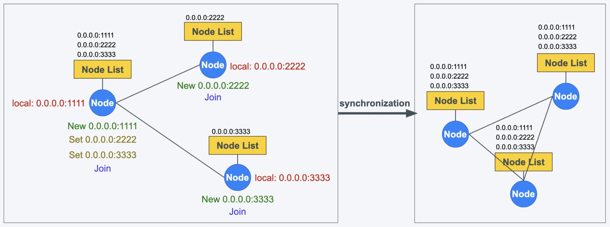
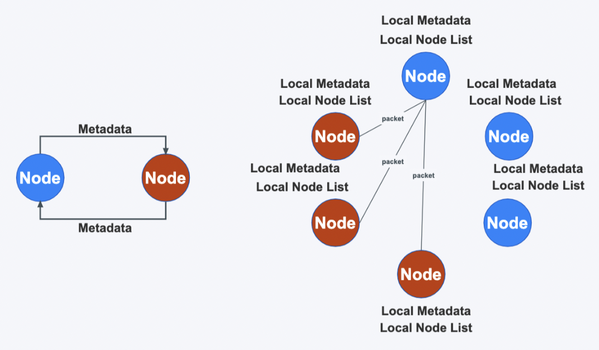

# XDP Gossip

## A Gossip protocol toolkit based on eBPF feature

Basic Gossip API is from [PekoNode](https://github.com/dpwgc/pekonode/tree/master)

### Implement function
##### Cluster node list sharing
* Synchronize the list of cluster nodes through rumor propagation `NodeList` (Each node will eventually store a complete list of nodes that can be used in service registration discovery scenarios)
##### Cluster metadata information sharing
* Publishing cluster metadata information through rumor spreading `Metadata` (The public data of the cluster, the local metadata information of each node is eventually consistent, and the storage content can be customized, such as storing some public configuration information, acting as a configuration center), The metadata verification and error correction function of each node of the cluster is realized through data exchange.
##### TCP or UDP protocol can be used to realize bottom communication interaction
* Customize the underlying communication protocol through the `NodeList - Protocol` field. UDP is used by default. If you want to pursue high reliability, you can use TCP.
##### Custom configuration
* The node list `NodeList` list provides a series of parameters for users to customize and configure. Users can use the default parameters, or fill in the parameters according to their needs.
***

### Implementation principle
##### `NodeList` Node list information synchronization
* Each node has a local node list NodeList.
* The background synchronization protocol of each node periodically encapsulates the node information into heartbeat data packets, and broadcasts it to some uninfected nodes in the cluster.
* After other nodes receive the heartbeat packet, they update their own local node list NodeList, and then broadcast the heartbeat packet to some uninfected nodes in the cluster.
* Repeat the previous broadcast step (rumor propagation method) until all nodes are infected, and this heartbeat infection ends.
* If there is a node in the local node list NodeList that has not sent the heartbeat update after timeout, delete the data of the timeout node.

##### `Metadata` Metadata information synchronization
* After a node calls the Publish() function to publish new metadata, the new data will spread to each node and then overwrite their local metadata information.
* Each node will periodically select a random node for metadata exchange check operation. If the metadata on a node is found to be old, it will be overwritten (anti-entropy propagation method).
* When a new node joins the cluster, the node will obtain the latest cluster metadata information through the data exchange function.

