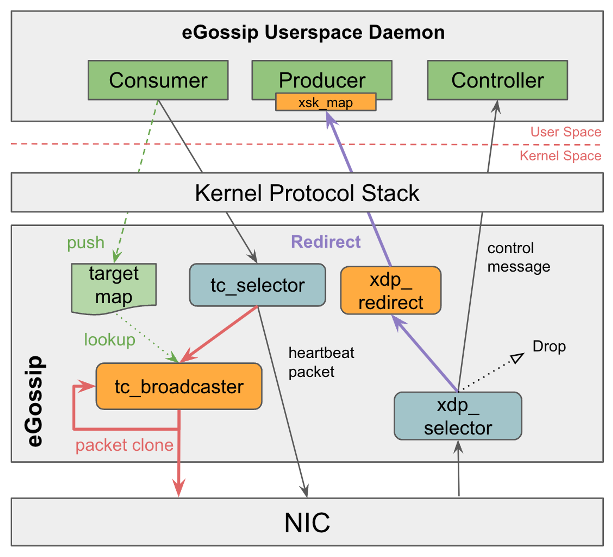

# eGossip

## About

The Extended Berkeley Packet Filter (eBPF) presents a transformative approach to dynamic micro-program loading and execution directly within the Linux kernel, circumventing the need for kernel recompilation.  
Our primary focus is the deployment of TC eBPF hooks for in-kernel packet cloning, aiming to enhance the efficiency of user-space broadcasts.  This approach is particularly pivotal in consensus algorithms like Gossip, which heavily rely on user-space broadcast mechanisms. We explore the implementation of this method, highlighting its ability to significantly boost broadcast speeds. Our findings reveal a marked improvement in CPU utilization, which decreased by 27\%, and in Transmit Bandwidth, which increased by a factor of 2.67, in Gossip-based systems. This research demonstrates the potential of eBPF in reducing the overhead of network protocol stacks and system calls, which significantly optimizes the common user-space broadcast behavior found in distributed consensus algorithms.

## Build & Test
Using make command it will build and run automatically.

Build binary file
``` 
make 
``` 

Build docker image 
``` 
make docker
``` 

Start a docker compose server

``` 
docker-compose up 
``` 

For k8s deployment:

``` 
kubectl apply -f k8s/deployment.yaml 
``` 

## Benchmark (only support k8s)

After deployment is ready, we can use our custom benchmark tool to test our server, first we should config the cluster first

```bash
 python3 script/test.py -c 
``` 

Then we can use ``-gl`` flag to check the nodeList size.
``` 
python3 script/test.py -gl 
``` 

Use ``-b`` flag to generate random metadata update event on a node.
``` 
python3 script/test.py -b
``` 

Switch to different protocol modes by changing ``PROTO`` in ``k8s/deployment.yaml``. We have three modes:

* **UDP mode:** Baseline.

    ```yaml
    - name: PROTO
        value: "UDP"
    resources:
        limits:
        cpu: "1"
        memory: "512Mi"
    ``` 
* **TC mode:** Only enable in-kernel boradcastor function.

    ```yaml
    - name: PROTO
        value: "TC"
    resources:
        limits:
        cpu: "1"
        memory: "512Mi"
    ``` 
* **XDP mode:** Enable both in-kernel boradcastor and ``AF_XDP`` kernel bypass.

    ```yaml
    - name: PROTO
        value: "XDP"
    resources:
        limits:
        cpu: "1"
        memory: "512Mi"
    ``` 

## Implement function

### eBPF Feature

#### In-kernel broadcastor
Using ebpf TC hook to implement a clone redirect with a resruion structure, allowing gossip to quickly replicate multiple copies by only sending a single packet to the Linux protocol stack.


> Attention !! In Linux network implementation, to avoid netlink or TC causing packet recursion too many times, which could lead to stack overflow, the ``XMIT_RESUION_LIMIT``  is set to 8. If Gossip needs to broadcast to more than 8 nodes, consider modifying the kernel source code.




### Gossip Protocol

Basic Gossip API is from [PekoNode](https://github.com/dpwgc/pekonode/tree/master)


##### Cluster node list sharing
* Synchronize the list of cluster nodes through rumor propagation `NodeList` (Each node will eventually store a complete list of nodes that can be used in service registration discovery scenarios)
##### Cluster metadata information sharing
* Publishing cluster metadata information through rumor spreading `Metadata` (The public data of the cluster, the local metadata information of each node is eventually consistent, and the storage content can be customized, such as storing some public configuration information, acting as a configuration center), The metadata verification and error correction function of each node of the cluster is realized through data exchange.
##### UDP protocol can be used to realize bottom communication interaction
* Customize the underlying communication protocol through the `NodeList - Protocol` field. UDP is used by default.

##### Custom configuration
* The node list `NodeList` list provides a series of parameters for users to customize and configure. Users can use the default parameters, or fill in the parameters according to their needs.
***

### Implementation principle
##### `NodeList` Node list information synchronization
* Each node has a local node list NodeList.
* The background synchronization protocol of each node periodically encapsulates the node information into heartbeat data packets, and broadcasts it to some uninfected nodes in the cluster.
* After other nodes receive the heartbeat packet, they update their own local node list NodeList, and then broadcast the heartbeat packet to some uninfected nodes in the cluster.
* Repeat the previous broadcast step (rumor propagation method) until all nodes are infected, and this heartbeat infection ends.
* If there is a node in the local node list NodeList that has not sent the heartbeat update after timeout, delete the data of the timeout node.


##### `Metadata` Metadata information synchronization
* After a node calls the Publish() function to publish new metadata, the new data will spread to each node and then overwrite their local metadata information.
* Each node will periodically select a random node for metadata exchange check operation. If the metadata on a node is found to be old, it will be overwritten (anti-entropy propagation method).
* When a new node joins the cluster, the node will obtain the latest cluster metadata information through the data exchange function.


